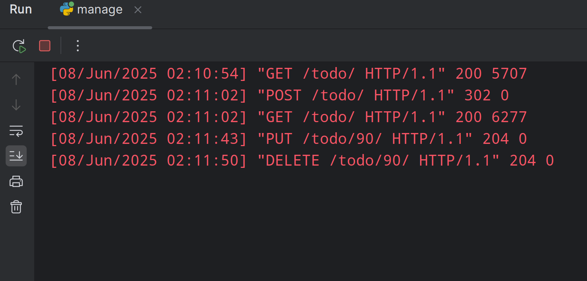

## Implement RESTFUL API
 - GET /todo/      : 获取 todo list
 - POST /todo/     : 添加一个 todo item
 - GET /todo/      : 添加一个 todo item 之后，重定向，发起一个新的 GET 请求以刷新页面
 - PUT /todo/90/   : 修改 item 90
 - DELETE /todo/90/: 删除 item 90

## 通过 fetch 函数实现 Ajax
- 删除、修改操作通过 fetch 函数实现，并且通过 DOM API 实现对页面的局部、无刷新修改